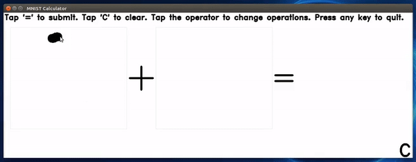

# mnist_calc
## Introduction
This project uses the TensorFlow mnist_deep network trained on the MNIST dataset to do digit classification for a handwriting-input calculator.  The digits are drawn with the mouse or a touchscreen.  Then when the user clicks '=' the digits are recognized and the equation is evaluated.



The provided Makefile does the following:
1. Builds tensorflow MNIST graph file from the tensorflow/mnist directory in the repository.
2. Copies the IR files from the mnist directory to the project base directory.
3. Runs mnist_calc.py, which creates a GUI window for calculator input and handles calculator control. 

## Running the Example
To run the example code do the following :
1. Open a terminal and change directory to the project base directory
2. Type the following command in the terminal: ```make run``` 

## Prerequisites
All development and testing has been done on Ubuntu 16.04 on an x86-64 machine.

This program requires:
- 1 Intel NCS device
- OpenVINO 2020.1 toolkit
- OpenCV with associated Python bindings*. 

## Makefile
Provided Makefile has various targets that help with the above mentioned tasks.

### make run
Runs the sample application.

### make help
Shows available targets.

### make all
Builds and/or gathers all the required files needed to run the application.

### make data
Gathers all of the required data need to run the sample.

### make deps
Builds all of the dependencies needed to run the sample.

### make default_model
Compiles an IR file from a default model to be used when running the sample.

### make install-reqs
Checks the requirements needed to run the sample.

### make uninstall-reqs
Uninstalls requirements that were installed by the sample program.
  
### make clean
Removes all the temporary files that are created by the Makefile.

